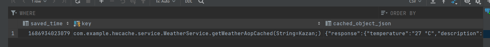

[](https://classroom.github.com/a/PtUitKZs)


# Caching
Консольное приложение по получению погоды.  Для удобстваа за основу взят Spring Boot, но при этом отключен WEB (настройка в properites). Поддерживается 4 вида кэширования: redis, postgresql, in memory(хранение в hashmap), spring caching.

### Использованные библотеки
| Библиотека  | Применение |
| ------------- | ------------- |
| Lombok | Сокращение количества boilerplate кода. Использование шаблона builder. |
| PostgreSQL  | Хранение кэша в базе данных. |
| Retrofit  | Типобезопасная обертка для OkHttp, которая делает запросы к API погоды. |
| Gson Converter  | Вспомогательная библиотека для Retrofit, которая преобразует json. |
| HttpLoggingInterceptor  | Логирование запросов и статусных кодов. |
| Redis  | Кэширование. |
| Lettuce  | Соединения с Redis. |
| Spring Aspects  | Реализации аннотации с кэшированием используя AOP. |
| Gson | Преобразование любого объекта в json, который можно хранить в базе данных. |

### Логика работы
Создана своя аннотация [AopCacheable](src/main/java/com/example/hwcache/aop/AopCacheable.java). Она указывается перед методом, возвращаемое значение которого требуется кэшировать.
Принимает 2 опциональных параметра: тип кэширования и время хранения в кэше. Пример: 
```Java
 @AopCacheable(cachePeriod = ONE_MINUTE, cacheType = DATABASE)
 public Weather getWeatherAopCached(String cityName) {
       ....
 }
```
Логика работы кэширования находится в классе [CacheAspect](src/main/java/com/example/hwcache/aop/CacheAspect.java). В зависимости от того, что указано в аннотации, выбирается нужный тип кэширования.
В базе данных кэш хранится в виде Json, где,помимо самого объекта, указаны ключ и время хранения. Ключом является имя пакета с классом и методом, а также типы параметров метода и его значения. Пример:



Такой ключ используется как для хранения в Postgres, так и для хранения в Redis. В случае с Redis хранится не объект обертка со временем, ключом и Json, а сам объект, который необходимо кэшировать. Такой объект должен реализовать интерфейс Serializable, чтобы Redis мог его преобразовывать.


### Что можно улучшить
* Продумать механику очистки кэша. Для редиса и спринга это выполняется автоматически, а для других хранилищ - нет.
* Кэш спринга чистится каждые 10 минут (всегда), даже если он не используется. Добавить логику отключения этого режима.
* 
