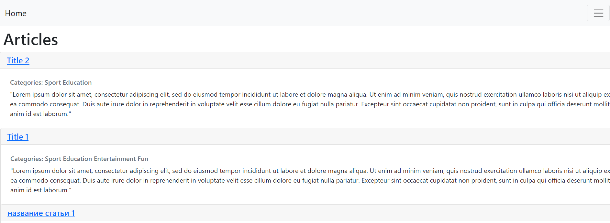

[](https://classroom.github.com/a/edemkxOB)


# Articles CMS

В этом проекте совмещены все предыдущие домашки (ViewResolver, LocaleResolver, LocaleConverter). Могут присутствовать недоработки и лишние файлы.

### Cледующие дз выполены:
- 7.1 (m2m + advanced pagination)
- 7.2 CMS

### Что реализовано в CMS
- [x] WYSWIG (tinyMCE)
- [x] SLUG (slugify)
- [x] [Inteceptor](src/main/java/ru/kpfu/itis/gnt/registration/config/SlugInterceptor.java) (не всегда отрабатывающий)
- [x] Filter script (на основе jsoup)

## m2m (article-category)


## Пагинация
<p align="middle">
   
   
   
</p>
<p align="middle">
   
   
   
</p>

## WYSWIG
<p align="middle">
   
</p>

## Slug
<p align="middle">
   
</p>

## Security

```Java
    @Bean
    public SecurityFilterChain filterChain(HttpSecurity http) throws Exception {
        http
                .authorizeHttpRequests((auth) -> auth
                        .requestMatchers("/article/delete/**").hasAuthority(UserRole.ADMIN.name())
                        .requestMatchers("/article/create/**").hasAuthority(UserRole.ADMIN.name())
                        .requestMatchers("/article/update/**").hasAuthority(UserRole.ADMIN.name())
                        .requestMatchers("/article/list").authenticated()
                        .anyRequest().permitAll()
                )
                .formLogin()
                .loginPage(User.LOGIN)
                .failureHandler((request, response, exception) -> response.sendRedirect(User.LOGIN + "?error=" + exception.getMessage()))
                .usernameParameter("username")
                .passwordParameter("password")
                .and()
                .logout().logoutUrl(User.LOGOUT).logoutSuccessUrl("/")
                .and()
                .exceptionHandling()
                .accessDeniedPage(PathConstants.Error.ACCESS_DENIED)
                .and()
                .csrf().disable();
        return http.build();
    }
```


## Что можно улучшить
- Не совсем понятно, как обрабатывать исключения с помощью CriteriaBuilder.
- Возможно, пагинация не полностью соответвует условию визуально, но работает правильно и стабильно. 
- Перечислять категории через запятую, да и в целом их как-то визуально выделять.
- Не удалось нормально настроить interceptor. Он не срабатывает на все ссылки, хоть и установлен путь "/**". [(Webconfig)](/src/main/java/ru/kpfu/itis/gnt/registration/config/WebConfig.java) Можно было сделать через HandlerMapping.


