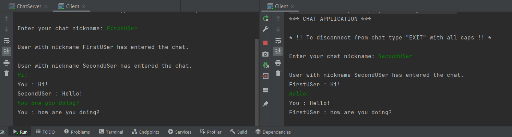

# Console Web Socket Chat

Многопользовательский консольный чат написанный на вебсокетах и "чистой" джаве. 

### Дополнительные библиотки

| Библиотека  | Применение |
| ------------- | ------------- |
| Lombok | Сокращение количества boilerplate кода. Использование шаблона builder. |
| Jackson  | Сериализация и десериализация объектов на основе JSON. |

### Логика работы
Общение сервера и клиента происходит путем обмена экземпляров класса [MessageObject](../console/src/main/java/ru/kpfu/itis/gnt/hwchat/models/MessageObject.java). Для этого используются два класса: [MessageEncoder](../console/src/main/java/ru/kpfu/itis/gnt/hwchat/serialization/MessageEncoder.java) и [MessageDecoder](../console/src/main/java/ru/kpfu/itis/gnt/hwchat/serialization/MessageDecoder.java). Они преобразуют сообщения как на стороне сервера, так и на стороне пользователя.
Чтобы такое общение работало, необходимо добавить эти классы в аннотации всех эндпоинтов. 
Пример:
```Java
@ServerEndpoint(value = "/chat", encoders = MessageEncoder.class, decoders = MessageDecoder.class) 
public class ChatServer {
    ...
}
```
Так как сообщения от клиента и сервера могут быть разного характера и сделать универсальный класс очень сложно, были введены типы, которые представлены классом [MessageType](../console/src/main/java/ru/kpfu/itis/gnt/hwchat/serialization/MessageType.java). Класс содержит следующие типы: 
> **REGULAR** - Простое сообщение в чате. (Между пользователями)

> **ERROR** - Сообщение об ошибке с сервера. Пример: существует пользователь с таким же ником. (С сервера клиенту)

> **REGISTRATION** - Регистрация нового пользователя в чате. (С клиента серверу)

> **CHAT_MEMBER_CHANGE** - Новый пользователь зашел в чат или существующий чат покинул. (Между пользователями)

> **CONNECTION_SUCCESS** - Пользователь успешно подключен и зарегистрирован. (С сервера клиенту)

> **DISCONNECT_USER** - Пользователь решил покинуть чат. (С клиента серверу)


### Скриншот



### Что можно улучшить

- Иcпользовать дженерики. Приводить к нужному классу в зависимости от типа. 
- Оптимизировать создание классов [MessageObject](../console/src/main/java/ru/kpfu/itis/gnt/hwchat/models/MessageObject.java) и [MessageData](../console/src/main/java/ru/kpfu/itis/gnt/hwchat/models/MessageData.java). Функции `builder()` и `build()` накладываются друг на друга, создаётся вложенность и код становится менее читабельным.
- Некоторые сообщения можно вынести в константы.
