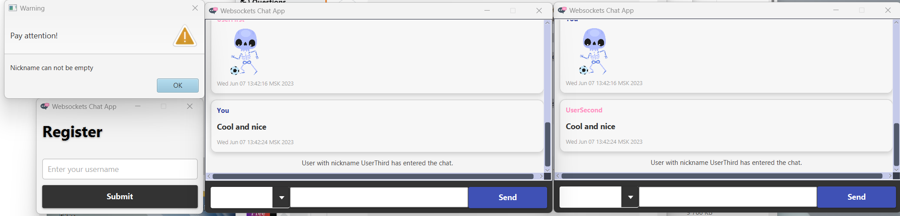

# JavaFx Web Socket Chat

Многопользовательский чат c  оконным интерфейсом написанный на вебсокетах и "чистой" джаве. 

### Дополнительные библиотки

| Библиотека  | Применение |
| ------------- | ------------- |
| Lombok | Сокращение количества boilerplate кода. Использование шаблона builder. |
| Jackson  | Сериализация и десериализация объектов на основе JSON. |

### Логика работы
Общение сервера и клиента происходит путем обмена экземпляров класса [MessageObject](../ui/src/main/java/ru/kpfu/itis/gnt/hwchat/models/MessageObject.java). Для этого используются два класса: [MessageEncoder](../ui/src/main/java/ru/kpfu/itis/gnt/hwchat/utils/MessageEncoder.java) и [MessageDecoder](../ui/src/main/java/ru/kpfu/itis/gnt/hwchat/utils/MessageDecoder.java). Они преобразуют сообщения как на стороне сервера, так и на стороне пользователя.
Чтобы такое общение работало, необходимо добавить эти классы в аннотации всех эндпоинтов. 
Пример:
```Java
@ServerEndpoint(value = "/chat", encoders = MessageEncoder.class, decoders = MessageDecoder.class) 
public class ChatServer {
    ...
}
```
#### ❗❗❗ Дополнения к консольной версии
- [AlertDialog](../ui/src/main/java/ru/kpfu/itis/gnt/hwchat/client/controllers/AlertDialog.java) - утилитный класс, который использутся для отображения ошибок. Реализован в виде билдере (без lombok) для удобства применения. Пример использования:
```Java
  AlertDialog.builder()
             .type(Alert.AlertType.ERROR)
             .contentText("Failed to open the chat due to : " + exception.getMessage())
             .buildAndShow();
```
- Класс [Sticker](../ui/src/main/java/ru/kpfu/itis/gnt/hwchat/models/Sticker.java), который содержит в себе преобразованное в строку изображение и код этого изображения (название файла без расширения). 
- [Репозиторий](../ui/src/main/java/ru/kpfu/itis/gnt/hwchat/server/StickerRepository.java) с изобрежениями, который сканирует всю папку /stickers и достаёт все файлы (даже вложенные) с расширением .png и хранит в себе.
 **При регистрации пользователю отправляется список из всех доступных на сервере стикеров. Изначально клиент о стикерах ничего не знает.**
 - [ImageConverter](../ui/src/main/java/ru/kpfu/itis/gnt/hwchat/utils/ImageConverter.java) кодирует изображение в строку и декодирует из строки в InputStream.

###### Подробнее о стикерах по шагам
1. При регистрации пользователь делает запрос на доступные стикеры.
2. Сервер обращается к репозиторию за стикерами.
3. Репозиторий предварительно отсканировал папку stickers. Все доступные стикеры отдаёт серверу.
4. Сервер формирует сообщение с типом `AVAILABLE_STICKER_LIST`, кладёт в сообщение список стикеров и отправляет клиенту. 
5. Клиент устанавливает список из строк в свой ComboBox. 
6. Пользователь выбирает стикер из комбокса -> отправляется код стикера с типом `STICKER`.
7. Сервер по коду стикера находит преобразованное в строку изображение и отправляет его всем другим пользователям.
8. Пользователи получают сообщение с типом стикер, преобразуют строку в InputStream, создают ImageView для стикера и добавляют сформированное сообщение в ScrollPane. 

Так как сообщения от клиента и сервера могут быть разного характера и сделать универсальный класс очень сложно, были введены типы, которые представлены классом [MessageType](../console/src/main/java/ru/kpfu/itis/gnt/hwchat/serialization/MessageType.java). Класс содержит следующие типы: 
> **REGULAR** - Простое сообщение в чате. (Между пользователями)

> **ERROR** - Сообщение об ошибке с сервера. Пример: существует пользователь с таким же ником. (С сервера клиенту)

> **REGISTRATION** - Регистрация нового пользователя в чате. (С клиента серверу)

> **CHAT_MEMBER_CHANGE** - Новый пользователь зашел в чат или существующий чат покинул. (Между пользователями)

> **REGISTRATION_SUCCESS** - Пользователь успешно подключен и зарегистрирован. (С сервера клиенту)

> **DISCONNECT_USER** - Пользователь решил покинуть чат. (С клиента серверу)

##### ❗❗❗ Дополнения к консольной версии

> **STICKER** Стикер. Клиент отправляет код, все остальные с сервера получают преобразованную строку. (Между пользвателями)

> **AVAILABLE_STICKER_LIST** Список доступных клиенту стикеров. Клиент отправляет запрос с данными типом, сервер отвечает этим же типом, но содержит уже список стикеров. (Между сервером и клиентом)


### Скриншот



### Что можно улучшить

- Иcпользовать дженерики. Приводить к нужному классу в зависимости от типа. 
- Оптимизировать создание классов [MessageObject](../console/src/main/java/ru/kpfu/itis/gnt/hwchat/models/MessageObject.java) и [MessageData](../console/src/main/java/ru/kpfu/itis/gnt/hwchat/models/MessageData.java). Функции `builder()` и `build()` накладываются друг на друга, создаётся вложенность и код становится менее читабельным.
- Некоторые сообщения можно вынести в константы.
##### ❗❗❗ Дополнения к консольной версии
- Реализовать конвертацию изображений на уровне Encoder и Decoder, а не вручную сторонним классом. 
- Напрямую не создавать стили в контроллере, а как-то это оптимизировать. Неудобно как читать, так и исправлять. 
